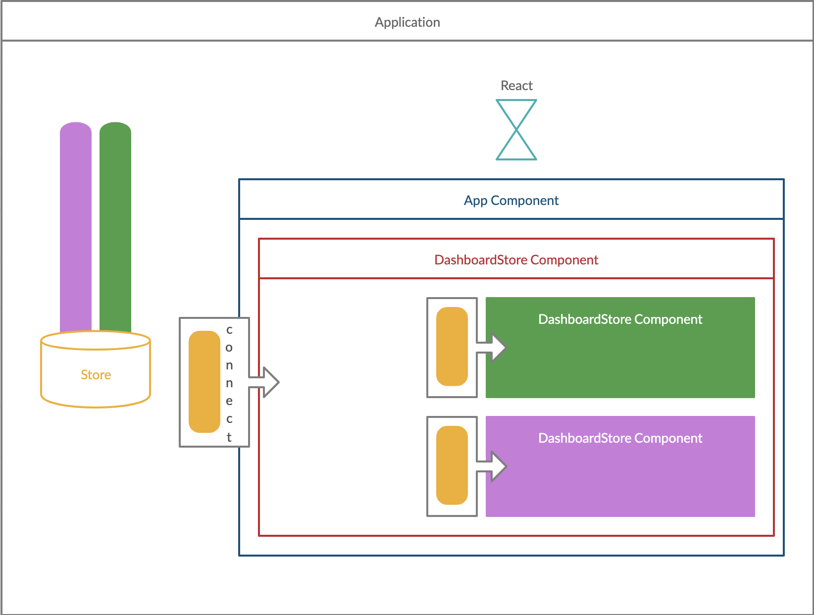
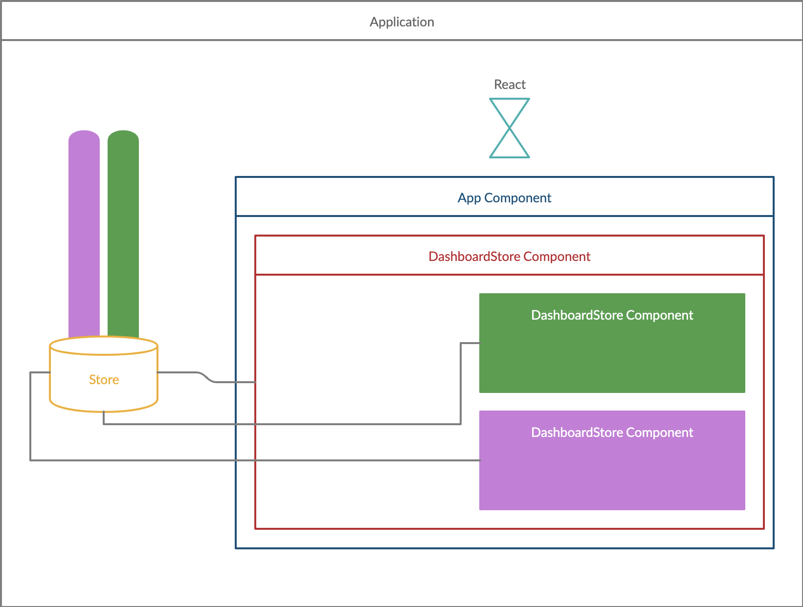
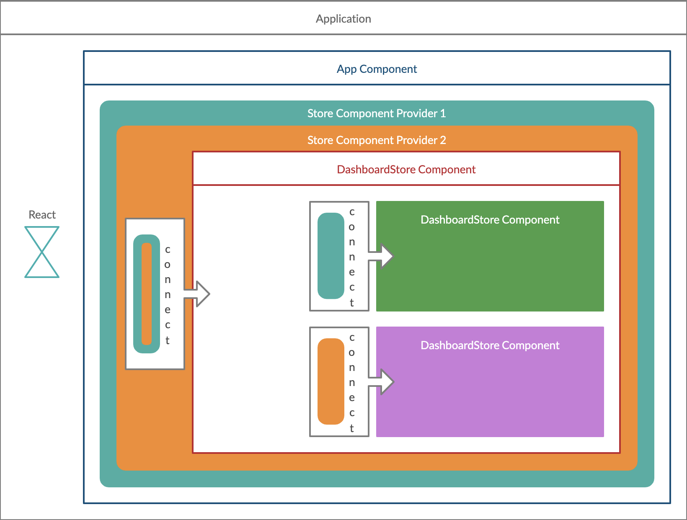

# Seamless migration path from redux to bare react

## Overview

Everything in life is a trade-off!

|           Why Redux            |            Why not redux             |
| :----------------------------: | :----------------------------------: |
|    Centralizing whole data     |    Managing multiple store slices    |
| Decoupling data from rendering |       Managing data dependency       |
| Easy to test reducers/actions  | Testing components becomes difficult |

## When to **(not?)** use redux

**Note**: This is only my personal experience

* If you have a small app :+1:
* If your app does not have many store slices :+1:
* Otherwise: find other ways :-1:
  * rxjs
  * React.Context
  * And on and on...

## Redux Architecture

As the state is managed out of the react lifecycle, then, communication between store and components happen through a bridge created by the `connect` function from `react-redux`

e.g.

```jsx
import { connect } from 'react-redux'

...

function ComponentA (props) { ... }

...

export default connect(mapStateToProps, mapDispatchToProps)(ComponentA)

```

What this basically do is creating a wrapper which will trigger a rerender everytime store is update. Yep, everytime, regardless of which slices have been changed.

Then, component will consume the state which is derived from the `mapStateToProps` and would send messages to the store through the actions from the `mapDispatchToProps`.

### Consuming state



### Dispatching message



## Our goal

The idea here is not changing the architecture abruptally, but, define smooth steps to do extract the state from redux. To do this, we are going to use the `React.Context`.

### What are we getting

* Components should not change, only connect differently
* Connecting to contexts ensure we are only updating when the context (store slice) gets changed
* Side effects triggers should be adapted, not changed (middlewares)
  * Saga
  * Thunks



### Live coding

```jsx
<Lets>
  <Code />
</Lets>
```

### First step - matching basic redux interface

As we think about having seamless step migrations, we first need to match the redux interface. So, we need to be able to connect, then, consume and send messages.

We can break it down into:

- `connect`
- `useStoreData`
- `useStoreProvider`

### Second step - look for the least dependants

It is a good strategy to look for the components with lesser dependencies. In our case, we go for `NumberStore` which is only using a slice and has no side-effects.

### Third step - matching middleware

Then, we need to make side-effects to work seamlessly. By this, we want to run the middleware for each dispatch.

### Fourth step - breaking out dependencies of slices

Lastly, we will break slice dependencies if you have. In our case, we don't have one.

I did not know how to put in words, but, what I mean by slice dependencies?!

When we have multiple slice listenning for the same message. Or when we have side effects sending messages to multiple slices.

Still, not have clear, isn't it?

#### Combined Saga

```jsx
import { put, takeEvery } from 'redux-saga/effects'
import { constants } from '../reducers/numberReducer'
import { actions as fibonacciActions } from '../reducers/fibonacciReducer'

function* incrementCombined(action) {
  const { payload } = action
  const { steps, increment } = payload
  
  yield put(increment())
  yield put(fibonacciActions.nextWithTimestamp(steps))
}

export default function* watchIncrementCombined() {
  yield takeEvery(constants.INCREMENT_COMBINED, incrementCombined)
}

// ...
// ...
// ...

// Calling on a component
store.dispatch({
  type: 'INCREMENT_COMBINED',
  payload: { steps: 3 }
})
```

How do we manage it?

## References

* [Redux](https://redux.js.org/basics/store)
* [Reselect](https://github.com/reduxjs/reselect)
* [Redux Saga](https://redux-saga.js.org/docs/introduction/BeginnerTutorial.html)
* [MirageJs](https://miragejs.com/quickstarts/react/development)
